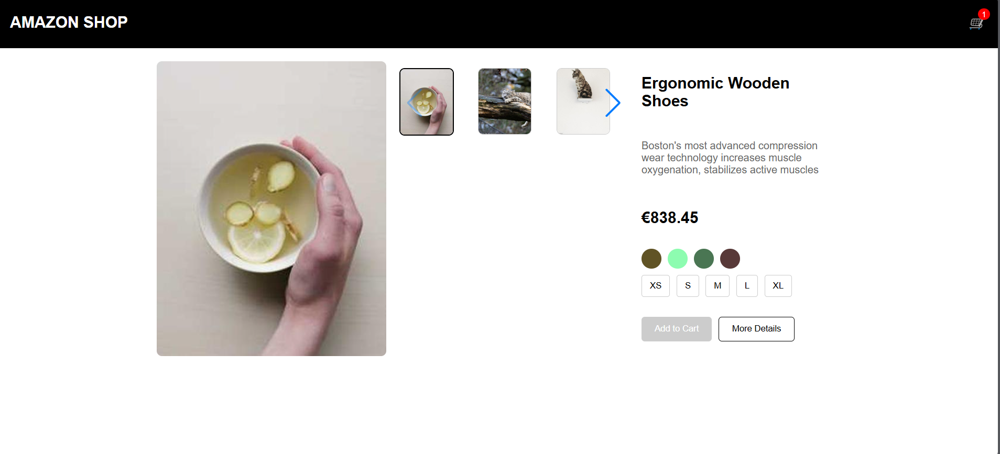

# Radix Product Page

A minimalist product page built using React and Radix UI components. This project showcases a side-by-side layout of a product image, details, and interactive elements like color and size selectors, along with a thumbnail carousel.

## Table of Contents

- [Demo](#demo)
- [Features](#features)
- [Installation](#installation)
- [Usage](#usage)
- [Technologies](#technologies)


## Demo



## Features

- Minimalist, clean, and modern UI
- Side-by-side layout of the product image and details
- Thumbnail carousel for product images with navigation arrows
- Color and size selectors that dynamically update the main product image
- Add to Cart and More Details buttons
- Responsive design for both desktop and mobile views

## Installation

To run this project locally, follow these steps:

1. **Clone the repository:**
   ```bash
   git clone https://github.com/your-username/radix-product-page.git

2. **Navigate to the project director::**
   ```bash
   cd radix-product-page

3. **Install dependencies:**
   ```bash
   npm install

4. **Start the development server:**
   ```bash
   npm start

## Usage
- Select Colors and Sizes: Click on the available color and size options to update the main product image.
- Thumbnail Navigation: Use the navigation arrows to scroll through the thumbnail carousel and click on thumbnails to change the main image.
- Add to Cart: The "Add to Cart" button is disabled until both color and size are selected.

## Technologies
- React: JavaScript library for building user interfaces.
- Radix UI: Accessible UI components for React.
- Swiper: Carousel component for the thumbnail slider.
- Styled Components: Styling library for React.
- Faker.js: Used to generate random product data for demonstration.